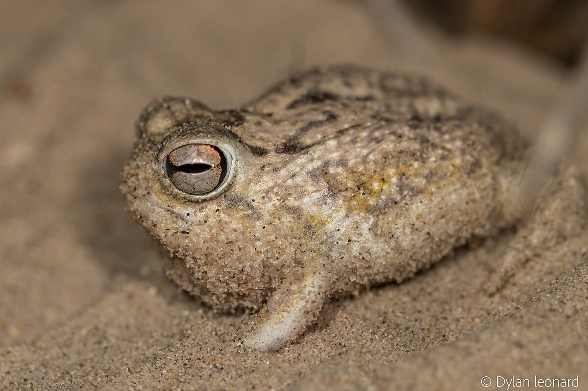
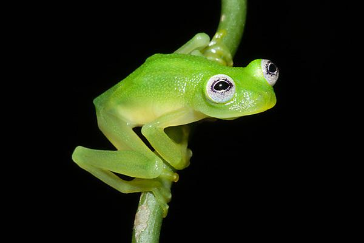
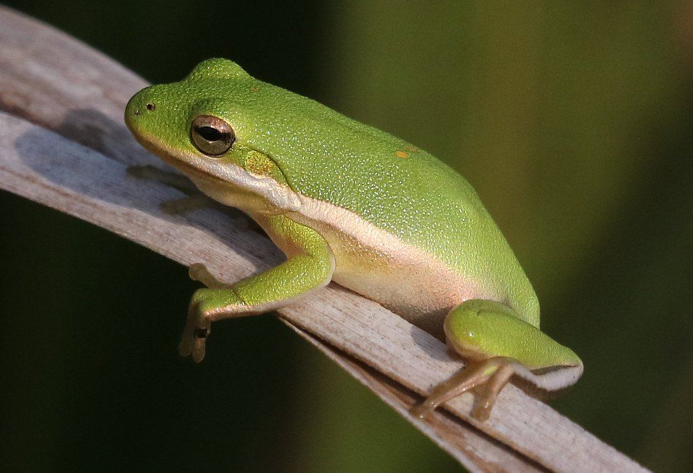
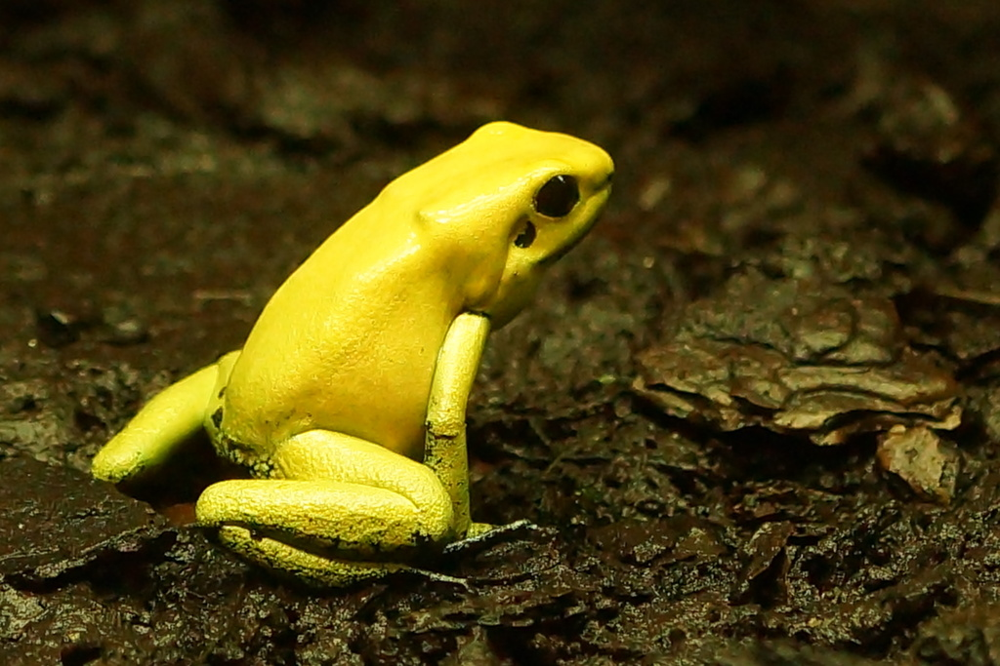
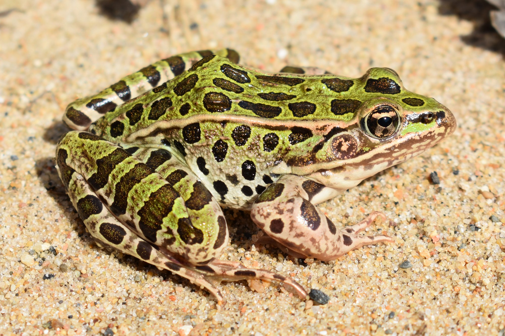
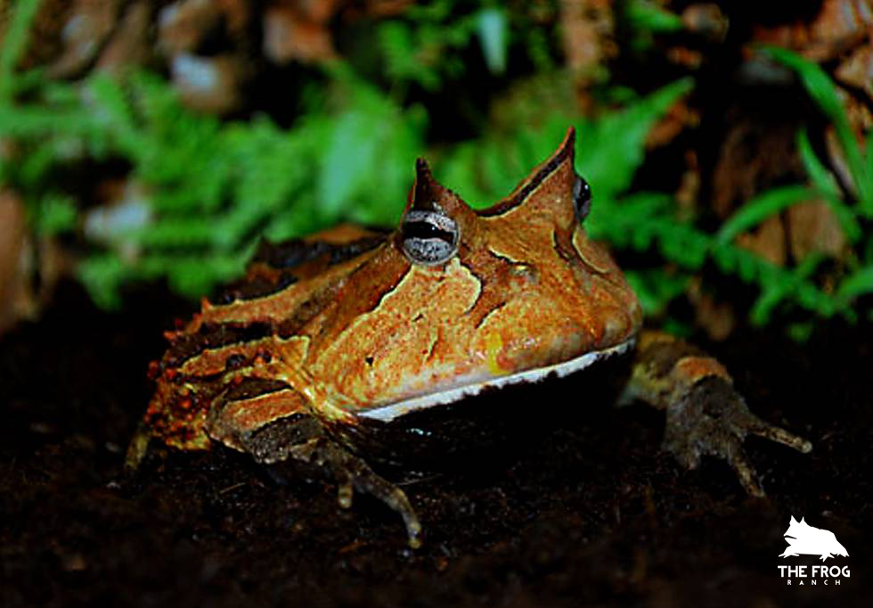

# 🐸 Frogs Classification Project

## 📌 Project Description

This project is a **machine learning classification system** that identifies different frog species from images using a trained TensorFlow Lite model. It can be used in mobile apps, desktop apps, or embedded systems to classify frogs in real time. The repository includes the trained model, screenshots of classification results, and example outputs.  

## 🎯 Why This Project Was Created

This project was created to:
- Demonstrate the use of **TensorFlow Lite** for image classification tasks.
- Provide a lightweight model suitable for mobile and embedded platforms.
- Help users understand how machine learning can be applied to species recognition and biodiversity monitoring.
- Support educational and conservation-oriented tools by automating frog species identification.

## 🛠️ Tools Used

✔️ **TensorFlow Lite** – Model format and inference engine  
✔️ Python / ML Libraries – (for model evaluation and preprocessing)  
✔️ Firebase (optional) – For backend integration in app prototypes  
✔️ Image assets and model screenshots included for documentation and demo

---

## 🐸 Frog Species Reference Table

This table shows the frog species this model can classify. Each entry includes an images, common name, scientific name, and a brief description.

## 🐸 Frog Species Reference Table

| Image | Class Name | Scientific Name | Description |
|------|------------|------------------|-------------|
|  | **American Bullfrog** | *Lithobates catesbeianus* | A large frog known for its deep croak and freshwater habitat. |
|  | **Poison Dart Frog** | *Dendrobatidae* | Brightly colored frogs with toxic skin secretions. |
|  | **Desert Rain Frog** | *Breviceps macrops* | Small burrowing frog adapted to sandy coastal deserts. |
|  | **Glass Frog** | *Centrolenidae* | Frog with semi-transparent belly skin. |
|  | **Green Tree Frog** | *Hyla cinerea* | Arboreal frog with sticky toe pads for climbing. |
|  | **Red-eyed Tree Frog** | *Agalychnis callidryas* | Green frog with red eyes, active at night. |
|  | **Golden Poison Frog** | *Phyllobates terribilis* | One of the most toxic animals in the world. |
|  | **Northern Leopard Frog** | *Lithobates pipiens* | Spotted frog found in wetlands and grasslands. |
|  | **Wood Frog** | *Lithobates sylvaticus* | Forest frog that can survive freezing temperatures. |
|  | **Surinam Horned Frog** | *Ceratophrys cornuta* | Large ambush predator with horn-like eye projections. |

---

